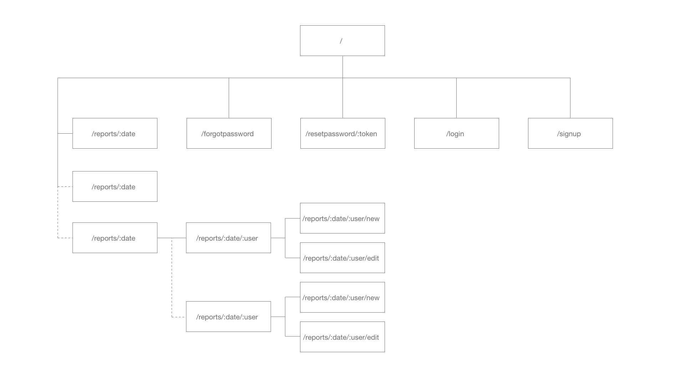
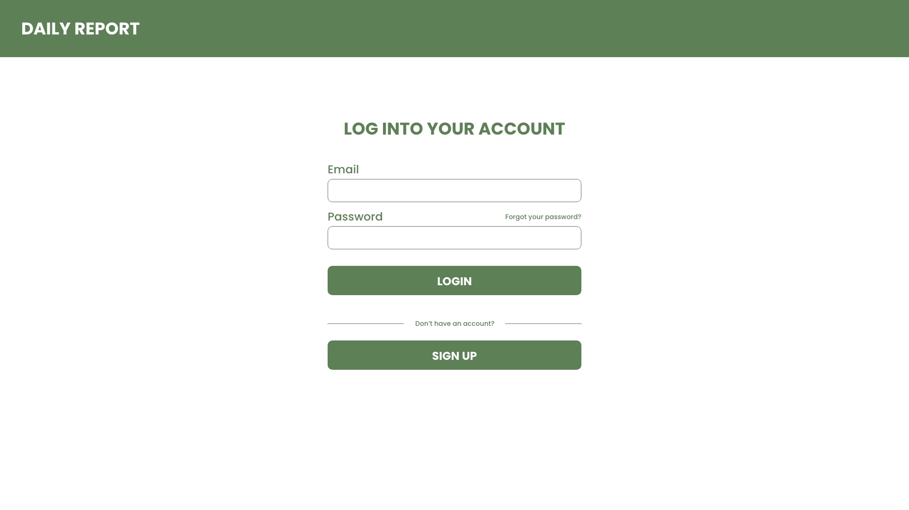
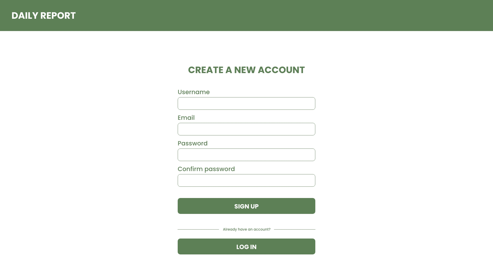
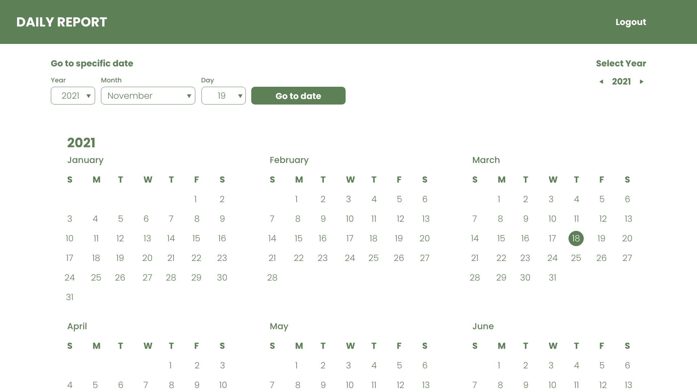
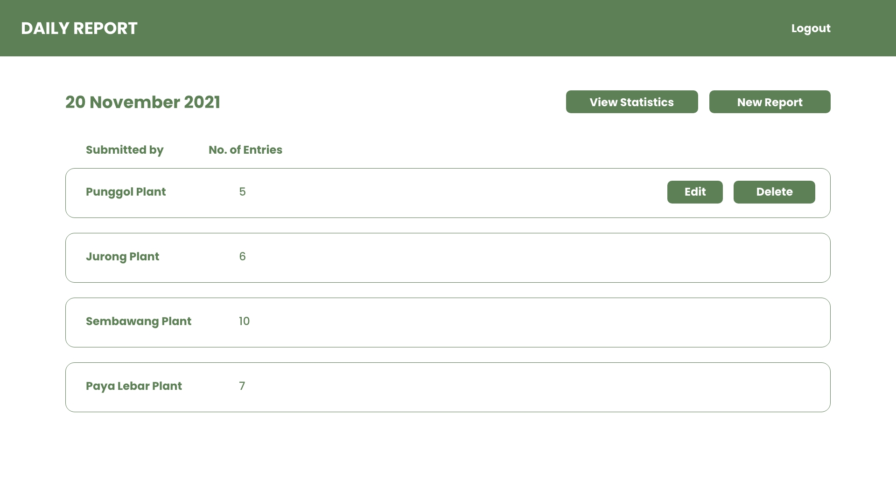
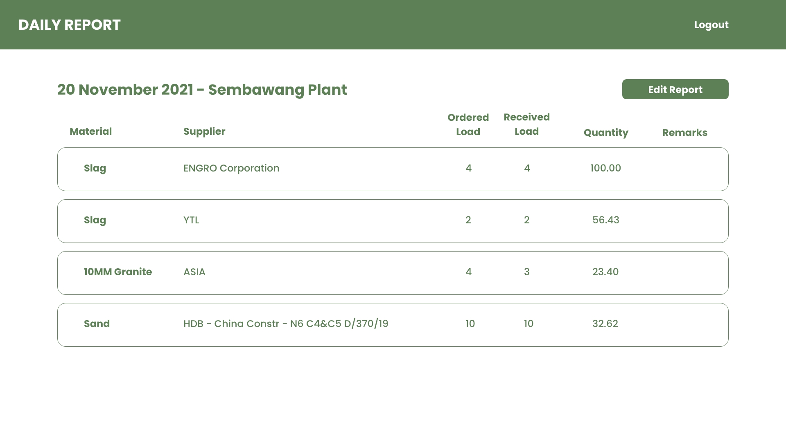
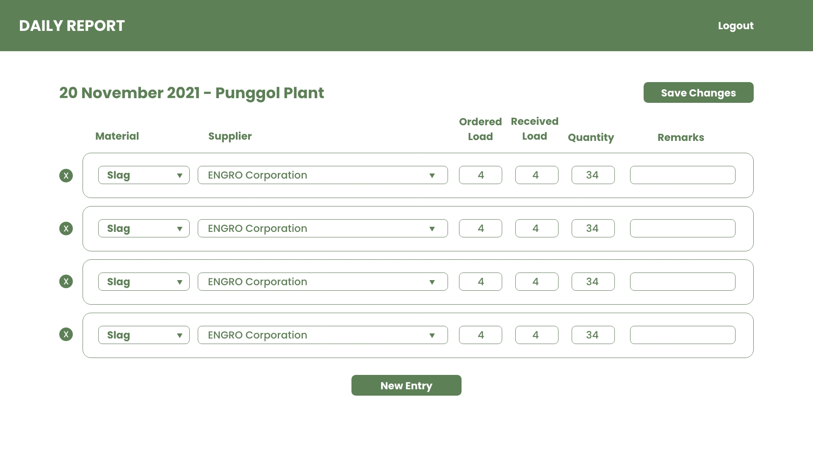

# Daily Report

Daily report app that tracks various elements

## Problem Statement

A supply company often needs to send reports on items ordered, delivered and received. Tracking for these kinds of activities is often done using excel sheets, but what if there was a better way to achieve this?

## Problem Solution

Daily Report is an app that allows one to submit reports for each day of the year. It will include user account creation and authentication for editing your own reports and viewing reports of others.

This will replace the need to constantly update and track excel sheets as relevant information will be stored on the cloud and will be easily accessible. Future additions to the app can even include statistics tracking and superaccounts which determines what items are inside the database (for managers overseeing departments)

## User Story & MVP

1. The user is able to create an account, log into the account and reset a forgotten password.
2. All dates of the year (and previous years) should be selectable and lead to a reports page showing reports from all users on that day.
3. Users should be able to create one report per day, and have the ability to edit and delete their own report and only view others' reports
4. Reports consist of entries, which consist of: Material (fixed list), Supplier (fixed list), Ordered Load, Received Load, Quantity and Remarks
5. The user should be able to freely edit their entries, remove entries and add new entries to their reports

### Extra

6. There should be a page where the user is able to view statistics for all reports submitted for that day. It will have multiple views depending on what the user wants to search for, e.g materials, suppliers, etc.

## Technology

Languages: HTML & CSS, Javascript, Node.js
Technologies: React, Express, Postgres

## Site Map

## Wireframes

\*The final design and wireframes may have some slight differences

### Login Page

### Signup Page

### Homepage

### Reports Page (by date)

### View report Page

### Edit/ new report Page

